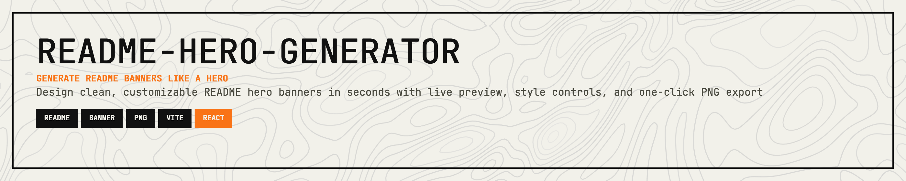
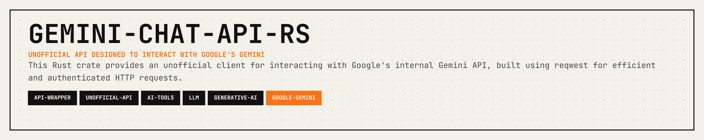
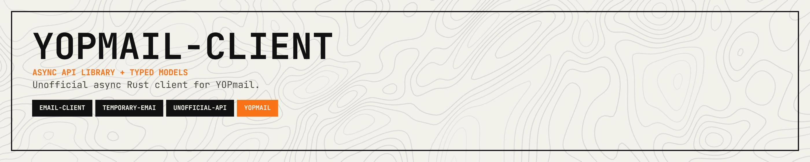
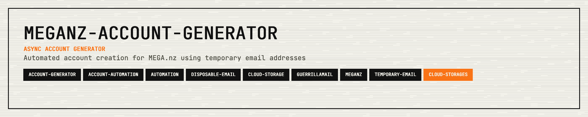
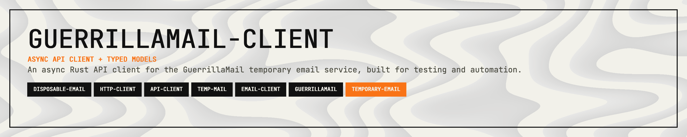

<p align="center">
  
</p>

<p align="center">
  <a href="LICENSE"></a>
  <a href="https://readme-hero-generator.vercel.app/"></a>
  <a href="https://git.woldtech.nl/CrucifiedMidget/readme-hero-generator/pulls"></a>
  <a href="https://react.dev/"></a>
</p>

<p align="center">
  <a href="#live-demo">Live Demo</a> · <a href="#what-it-does">What It Does</a> · <a href="#examples">Examples</a> · <a href="#run-locally">Run Locally</a> · <a href="#build">Build</a> · <a href="#support">Support</a> · <a href="#license">License</a>
</p>

---

## Live Demo

https://readme-hero-generator.vercel.app/

## What It Does

- Renders a banner preview in the browser.
- Lets you edit:
  - project name
  - subtitle
  - description
  - tags
  - accent color
  - background style (`NONE`, `DOTS`, `GRID`, `SCAN`, `WAVE`, `VOID`, `ZEBRA`)
  - light/dark mode
- Exports a PNG with a 1400x280 design size (`@2x` render for sharper output).

## Examples

### Example 1

<p align="center">
  
</p>

### Example 2

<p align="center">
  
</p>

### Example 3

<p align="center">
  
</p>

### Example 4

<p align="center">
  
</p>

### Example 5

<p align="center">
  
</p>

## Run Locally

```bash
npm install
npm run dev
```

Open the local Vite URL shown in the terminal.

## Build

```bash
npm run build
npm run preview
```

## Support

If this project saves you time or helps your work, support is appreciated:

[](https://ko-fi.com/11philip22)

## License

This project is licensed under the MIT License; see [LICENSE](https://opensource.org/license/MIT) for details.
